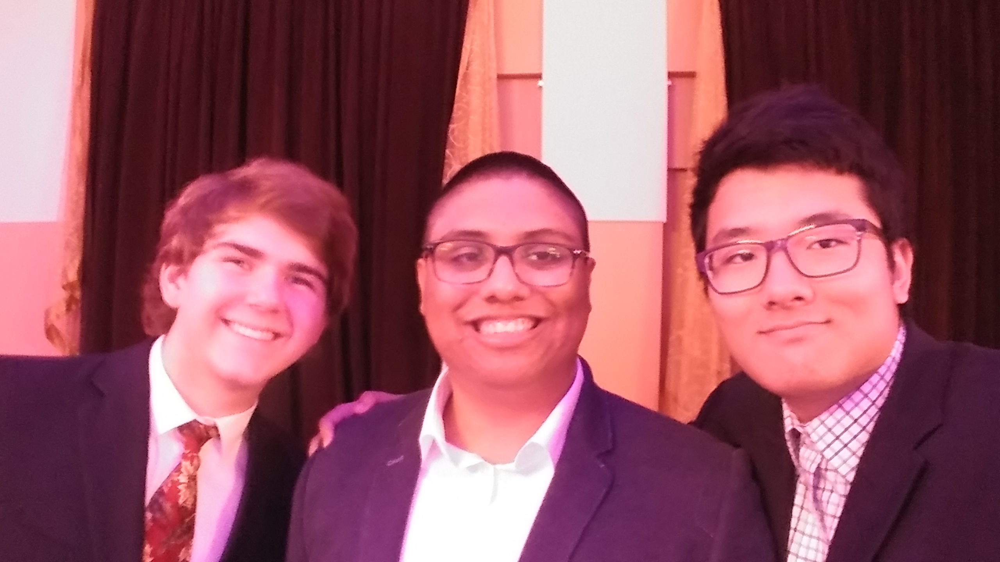

# Introduction

Hello, my name is Richard. I am currently a fourth year Computer Engineering major in the ECE department. I have coded in Java, C++, and Python. I also have some experience with Quartus. For our digital systems class, we built SHA-256, which used in Bitcoin blockchain technology, based on provided testbench.

I was born in Korea, and I am currently 22 years old. When I was about 10 years old, my father wanted me to study abroad in America because he believed that education there was better, and also partially because he wanted to see me during his a lengthy business trip in California. So ever since then, I have basically naturalized as a San Diegan; I never left San Diego. I was able to meet amazing people here, and have had awesome experience.

I'm the guy on right! The other two are two of my best friends I met in high school.

As for hobbies, I like to play videogames, and I also enjoy cooking food.

# Style

It is *interesting to see* how tone you are reading in your head **changes** based on the font size or style. ~~Does this sentence "sound" more snarky than the other ones?~~

**Testing for _extreme_ sentence**

***Testing for bold AND italic***

> Remember, there are no bad teachers, only bad students. - My high school teacher

# Coding tip

Users can type `echo (message)` in the terminal to display the message right back, or redirect it into a file by typing `echo (message) > (file name)` to avoid having to open up a text editor to create a text file.

# Links

I have listed [games I play frequently](index.md#Game-Lists) below, so if you do play any of below, let me know and maybe we can play together!

[Testing file](CSE110Testing.txt) for the relative link.

# Game Lists

### Games I play frequently

- Heroes of the Storm
- Dead by Daylight
- Genshin Impact
- Hearthstone (Battleground)
- Spelunky 2

### ... In order of frequency

1. Genshin Impact
2. Dead by Daylight
3. Hearthstone (Battleground)
4. Spelunky 2
5. Heroes of the Storm

# Words that start with...

- A
  - Apple
  - Arby's
- B
  - Banana
  - Bass
   
# Checklist

- [ ] Get enough sleep
- [ ] Finish CSE 101 Homework
- [ ] Finish CSE 110 Homework
- [ ] Finish CSE 141 Homework
- [ ] Finish CSE 141L Homework
- [X] Reach stage 2 in Spelunky 2
- [X] Procrastinate by watching Youtube

***Uh-oh.***
