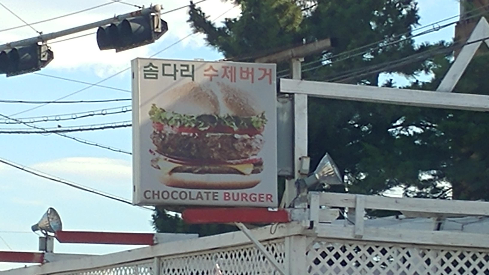
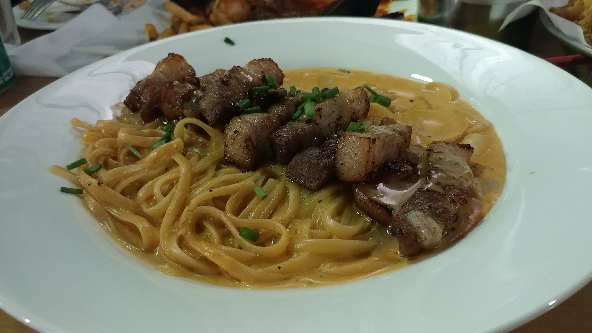
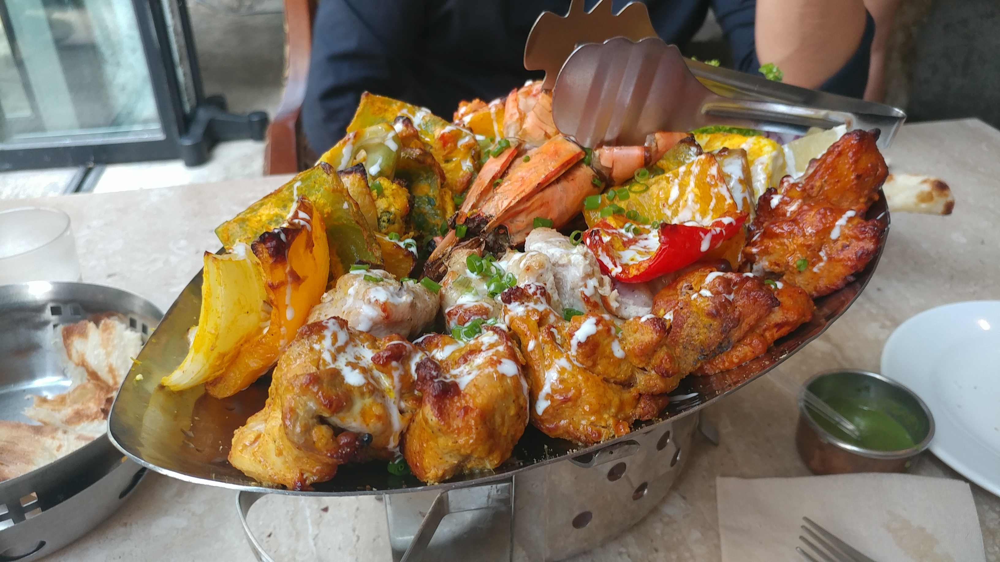

# Food pictures!

### Uhh, chocolate burger?

To quote Forrest Gump, 
> Life is like a box of chocolate; you never know what you are going to get.

That must mean that this chocolate burger *could be* potentially good, right? ***right?*** ~~I take no responsibility for your ruined tastebud~~

### Thick bacon cream pasta

### Salmon sashimi

**salmon is the best fish, _ever_.**

### Platter in AYCE curry resturant

**AYCE curry is awesome!**

# Coding tip

Users can type `echo (message)` in the terminal to display the message right back, or redirect it into a file by typing `echo (message) > (file name)` to avoid having to open up a text editor to create a text file.

# Links

Can I quickly just redirect you to the [chocolate burger advertisement](https://github.com/euh006/euh006.github.io/blob/main/index.md#coding-tip) again? Thanks. I just want to share it with everyone so it's not just me who saw this atrocity.

And this is the [configuration](./_config.yml) I used for the website.

# Game Lists

### Games I play frequently

- Heroes of the Storm
- Dead by Daylight
- Genshin Impact
- Hearthstone (Battleground)
- Spelunky 2

### ... In order of frequency

1. Genshin Impact
2. Dead by Daylight
3. Hearthstone (Battleground)
4. Spelunky 2
5. Heroes of the Storm

# Words that start with...

- A
  - Apple
  - Arby's
- B
  - Banana
  - Bass
   
# Checklist

- [ ] Get enough sleep
- [ ] Finish CSE 101 Homework
- [ ] Finish CSE 110 Homework
- [ ] Finish CSE 141 Homework
- [ ] Finish CSE 141L Homework
- [X] Reach stage 2 in Spelunky 2
- [X] Procrastinate by watching Youtube

***Uh-oh.***
